# Google Sheets for a-blog cms

a-blog cms Ver.2.8.0より拡張アプリ「Google Sheets」を利用できるようになります。 a-blog cmsの拡張アプリ「[Google Sheets](https://www.google.com/sheets/about/)」を使うとお問い合わせフォームなどで送信された内容を任意のGoogle SpreadSheetの最後の行に追記することができます。

## ダウンロード
[Google Sheets for a-blog cms](https://github.com/appleple/acms-google-sheets/raw/master/build/GoogleSheets.zip)

## 下準備

以下の2つのステップで a-blog cms と [Google Sheets](https://www.google.com/sheets/about/) を連携します。

1. ClientID JSON の取得
2. ClientID JSON を CMS側に登録

### ClientID JSON の取得

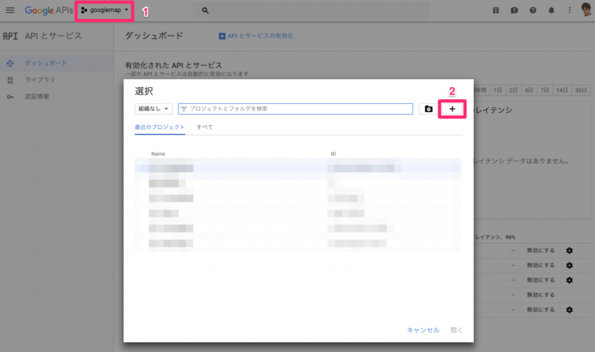

まずは、[Google API Console](https://console.developers.google.com/) にアクセスしてログインしてください。ログイン後、任意の名前でプロジェクトを作成します。 上の画像のように 1, 2 の手順でプロジェクトを新規作成できます。

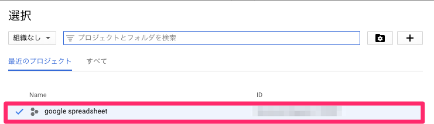

左上のセレクトメニューをクリックし、先ほど作成したプロジェクトを選択します。

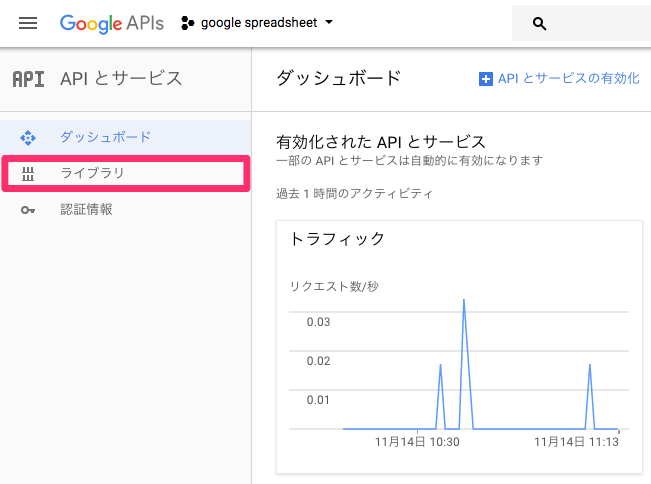

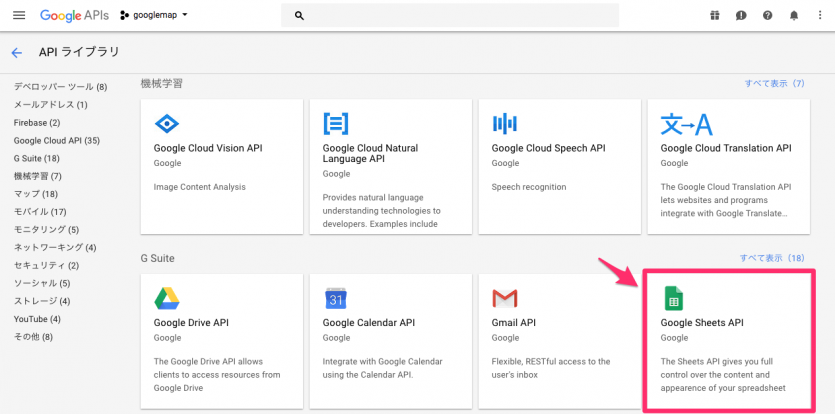

次は、サブカラムより「ライブラリ」という項目をクリックし、API ライブラリのページに移動します。そのページにて、Google Sheet APIという項目を検索して有効化してください。

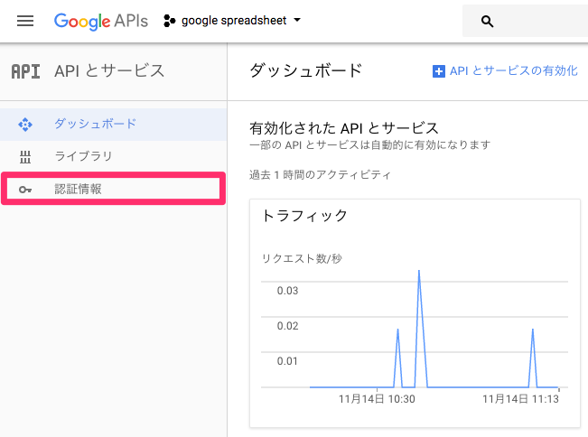

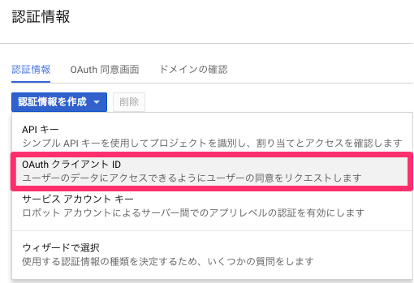

最後に「認証情報」をクリックして認証情報の設定画面に移動します。そこで新たにOAuth クライアント ID を作成します。 アプリケーションの種類として、「ウェブアプリケーション」を設定して、「認証済みのリダイレクトURI」には「ドメイン名/bid/（現在使用しているブログのBID）/admin/app_google_sheets_callback/」を設定します。

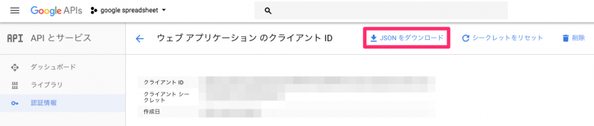

その後、クライアントIDなどの情報が記述されたJSONファイルをダウンロードしましょう。その後、ダウンロードしたJSONファイルをサーバーにアップロードします。ドキュメントルート以下にアップロードをするとブラウザからアクセスできてしまいますので、ドキュメントルートより上の階層にアップロードするのが望ましいです。

## 2. ClientID JSON を CMS側に登録
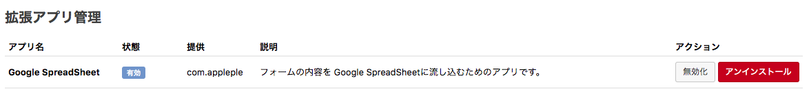

次はCMS側の設定です。まずは、拡張アプリからHook処理をかけるようにconfig.server.phpを1にします。

```php
define('HOOK_ENABLE', 1);
```

管理画面 > 拡張アプリより、 Google Sheets をインストールします。インストール完了後は、管理画面 > Google Sheets より Google Sheets の管理画面に移動します。

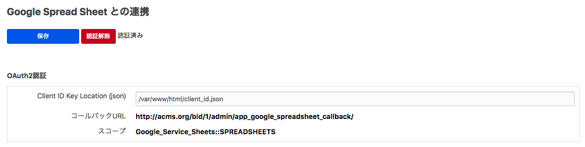
そして先ほど設置したJSONファイルへのパスを記述します。絶対パスで記述しましょう。パスを記述後、設定を保存してから、「認証」ボタンをクリックして認証するようにしましょう。

※ablogcms.ioで行う場合は、ルートディレクトリには設置できないため、「themes」フォルダなどにJSONファイルを設置します。 ablogcms.ioでの記述例： /var/www/vhost/xxxxxx.ablogcms.io/html/themes/xxxxxxxx.json


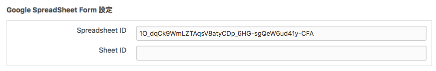

またこの管理ページ内でa-blog cmsのFormIDに対して書き込みしたい Google Sheets のIDを指定する必要があります。 SpreadsheetIDと SheetID は、開いている スプレッドシートのURLから調べることができます。

https://docs.google.com/spreadsheets/d/{SpreadsheetID}/edit#gid={SheetID}

設定が完了すれば、お問い合わせフォームから送信された内容を Google Sheets に自動で追加登録できます。下の図のような実行結果になっていれば成功です。

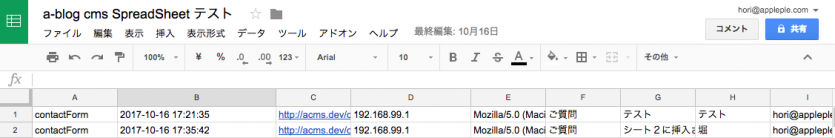
