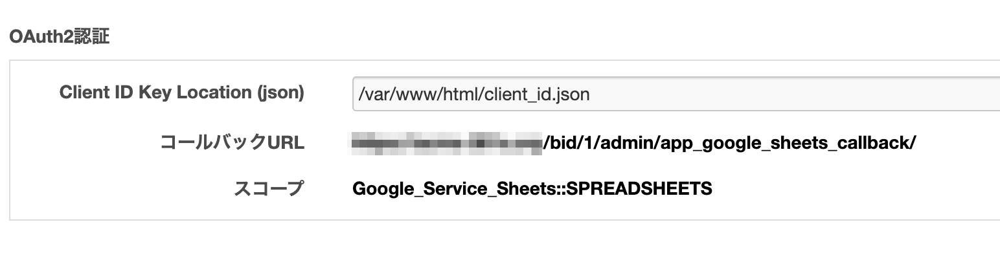
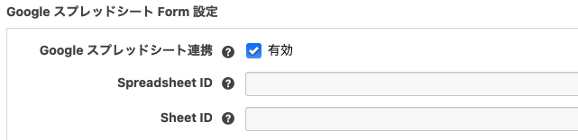

# Google Sheets for a-blog cms

a-blog cms Ver.2.8.0 より拡張アプリ「Google Sheets」を利用できるようになります。 a-blog cms の拡張アプリ「[Google Sheets](https://www.google.com/sheets/about/)」を使うとお問い合わせフォームなどで送信された内容を任意の Google SpreadSheet の最後の行に追記することができます。

## 動作環境

- a-blog cms >= 2.8.0
- php >= 5.6

## ダウンロード

[Google Sheets for a-blog cms](https://github.com/appleple/acms-google-sheets/raw/master/build/GoogleSheets.zip)

## 下準備

以下の 2 つのステップで a-blog cms と [Google Sheets](https://www.google.com/sheets/about/) を連携します。

1. ClientID JSON の取得
2. ClientID JSON を CMS 側に登録

### ClientID JSON の取得


まずは、[Google API Console](https://console.developers.google.com/) にアクセスしてログインしてください。ログイン後、任意の名前でプロジェクトを作成します。 上の画像のように 1, 2 の手順でプロジェクトを新規作成できます。


左上のセレクトメニューをクリックし、先ほど作成したプロジェクトを選択します。


次は、サブカラムより「ライブラリ」という項目をクリックし、API ライブラリのページに移動します。そのページにて、Google Sheet API という項目を検索して有効化してください。


最後に「認証情報」をクリックして認証情報の設定画面に移動します。そこで新たに OAuth クライアント ID を作成します。 アプリケーションの種類として、「ウェブアプリケーション」を設定して、「認証済みのリダイレクト URI」には「ドメイン名/bid/（現在使用しているブログの BID）/admin/app_google_sheets_callback/」を設定します。

※ablogcms.io で行う場合は、「OAuth 同意画面」のページにある公開ステータスの項目を「テスト」にすることで「認証済みのリダイレクト URI」に正常に登録できます（2021 年 3 月現在）


その後、クライアント ID などの情報が記述された JSON ファイルをダウンロードしましょう。その後、ダウンロードした JSON ファイルをサーバーにアップロードします。ドキュメントルート以下にアップロードをするとブラウザからアクセスできてしまいますので、ドキュメントルートより上の階層にアップロードするのが望ましいです。

## 2. ClientID JSON を CMS 側に登録


次は CMS 側の設定です。まずは、拡張アプリから Hook 処理をかけるように config.server.php を 1 にします。

```php
define('HOOK_ENABLE', 1);
```

管理画面 > 拡張アプリより、 Google Sheets をインストールします。インストール完了後は、管理画面 > Google Sheets より Google Sheets の管理画面に移動します。


そして先ほど設置したJSONファイルへのパスを記述します。絶対パスで記述しましょう。パスを記述後、設定を保存してから、「認証」ボタンをクリックして認証するようにしましょう。

※ablogcms.io で行う場合は、ルートディレクトリには設置できないため、「themes」フォルダなどに JSON ファイルを設置します。 ablogcms.io での記述例： /var/www/vhost/xxxxxx.ablogcms.io/html/themes/xxxxxxxx.json

※認証はフォームの送信先となるブログで行ってください。

## 3. フォーム ID に書き込みしたい SpreadsheetID と SheetID を紐づける

さらに CMS の管理ページで、フォーム ID に対して書き込みしたい Google Sheets の ID を指定する必要があります。管理画面 > フォームより、Google スプレッドシートと紐付けたいフォーム ID の変更画面に移動すると、「Google スプレッドシート Form 設定」という項目が増えています。



SpreadsheetID と SheetID は、開いている スプレッドシートの URL から調べることができます。

https://docs.google.com/spreadsheets/d/{SpreadsheetID}/edit#gid={SheetID}

設定が完了すれば、お問い合わせフォームから送信された内容を Google Sheets に自動で追加登録できます。下の図のような実行結果になっていれば成功です。


